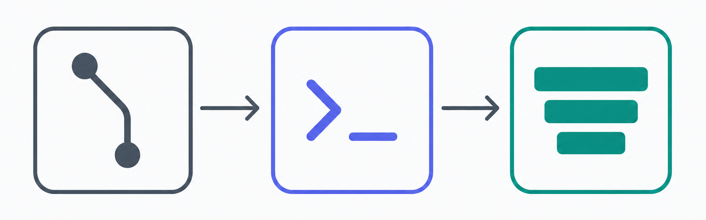
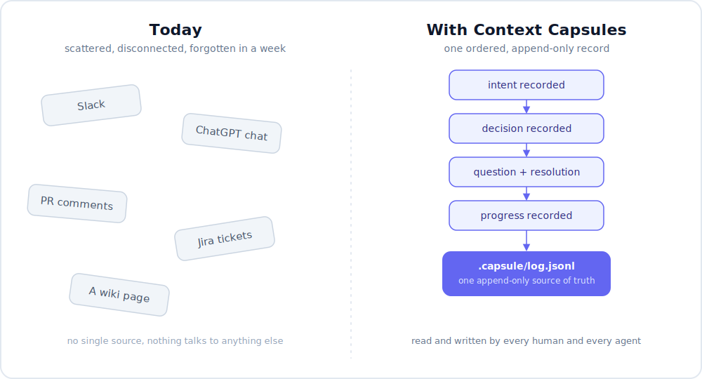
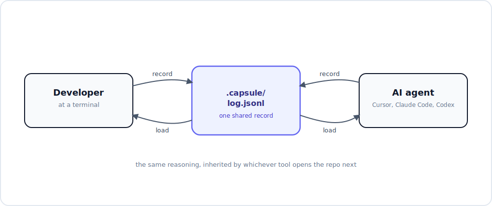
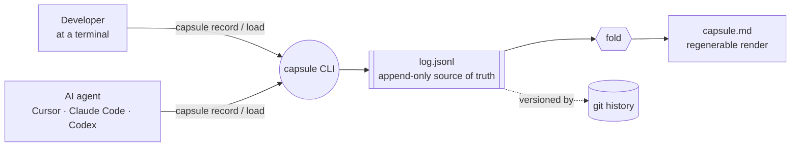
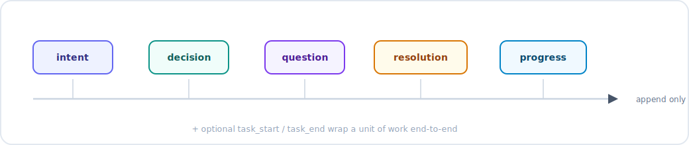
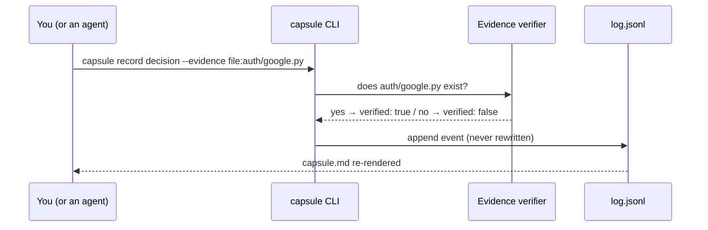
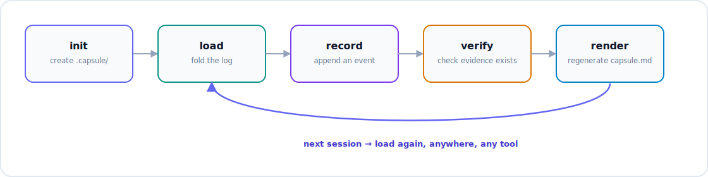
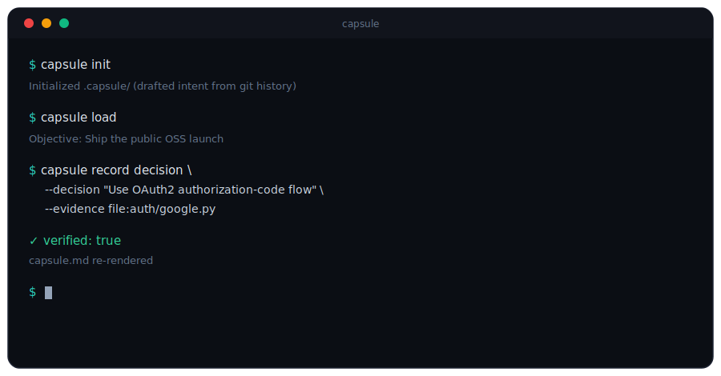

<p align="center">
  
</p>

<h1 align="center">Context Capsules</h1>

<p align="center">
  <strong>Git stores what changed. Context Capsules stores why.</strong>
</p>

<p align="center">
  Durable, project-owned memory for the intent, decisions, and reasoning behind your code.<br/>
  Local-first, open, and shared by every human and every AI tool that touches the repo.
</p>

<p align="center">
  <a href="LICENSE"></a>
  <a href="pyproject.toml"></a>
  <a href="https://github.com/CognitivTrust/context-capsules/actions/workflows/ci.yml"></a>
  <a href="CHANGELOG.md"></a>
  <a href="CONTRIBUTING.md"></a>
</p>

<p align="center">
  <a href="#installation"></a>
  <a href="#quickstart"></a>
  <a href="SETUP.md"></a>
  <a href="https://github.com/CognitivTrust/context-capsules"></a>
</p>

<p align="center"><em>Context should belong to the project, not the tool.</em></p>

<br/>

## You've felt this before

You explain the project to your AI agent. Again. You open a new chat and re-paste the same three paragraphs of background. Again. A teammate asks "wait, why did we do it this way?" and the honest answer is *"someone explained it to me on a call in March, ask them."*

- The decision your team debated for an hour, then forgot to write down anywhere durable.
- The constraint a newcomer (human or agent) will violate on day one, because nobody told them it exists.
- The thing you already tried that didn't work, so nobody wastes another week trying it again.
- The cold start, repeated every session, every tool switch, every new hire.

None of that lives in your code. **Git only remembers *what* changed.** The reasoning, the *why*, is scattered across chat windows, Slack threads, PR comments, and people's heads, and it quietly evaporates.

> [!TIP]
> If any of that sounds familiar, you already understand why this project exists. Keep scrolling.

<br/>

## The thesis

AI coding tools have memory for a session. **Projects need memory for years.**

Your code already has a source of truth that outlives any person, branch, or tool: it's called Git. The reasoning behind your code has no equivalent. **Context Capsules is that missing source of truth**: owned by the project, readable and writable by anyone and anything working on it.

<br/>

## Why everything else falls short

Each tool you already use holds a fragment of the answer. None of them holds *the* answer.

| Tool | What it gives you | What it's missing |
| --- | --- | --- |
| **Git** | An exact record of *what* changed, line by line. | The *why*. A diff never tells you what you rejected, or what you were trying not to break. |
| **Chat history** (ChatGPT, Cursor, Claude Code) | A transcript of one conversation. | It's per-tool, per-session, and disposable: buried in thousands of lines you'll never reopen. |
| **Slack** | A real-time conversation. | Decisions happen there and scroll away. Search is a graveyard, not a source of truth. |
| **Documentation** | A snapshot, written once. | Wrong time, wrong place. It lives away from the code, nobody updates it, and it rots. |
| **AI "memory" features** | Continuity for *you*, in *one vendor's* product. | It doesn't belong to the project, doesn't move between tools, and vanishes when a teammate opens the repo. |

<p align="center">
  
</p>

<br/>

## The insight

> We solved source control for code. **We never solved source control for context.**

The single most valuable artifact in a software project, the accumulated reasoning behind it, is also the most fragile. It's the first thing lost between sessions and the last thing anyone writes down.

The fix isn't another doc, another wiki, or a smarter chat search. It's a new primitive: **a durable, project-owned memory that lives next to the code, captures the *why* the moment a decision is made, and is read by every tool before it acts.**

That primitive is a **Context Capsule**.

<br/>

## What Context Capsules is

Context Capsules is an open standard and a local-first system for durable project memory. Today it ships as a CLI called `capsule`, built on four properties:

<table>
<tr>
<td width="25%" align="center">
  <br/>
  <strong>Local-first</strong><br/>
  <sub>No account, no telemetry, no SaaS. Lives in your repo, not a vendor's database.</sub>
</td>
<td width="25%" align="center">
  <br/>
  <strong>Append-only</strong><br/>
  <sub>A durable ledger of intent, decisions, questions, resolutions, and progress. Nothing is ever rewritten.</sub>
</td>
<td width="25%" align="center">
  <br/>
  <strong>Evidence-checked</strong><br/>
  <sub>Decisions can cite a file, commit, test, or URL. The engine confirms it exists: locally, deterministically.</sub>
</td>
<td width="25%" align="center">
  <br/>
  <strong>Tool-agnostic</strong><br/>
  <sub>One standard, versioned independently of any vendor. Cursor, Claude Code, Codex, or a human at a terminal: same record.</sub>
</td>
</tr>
</table>

The CLI is the first implementation of the idea, not the idea itself. **The product is the primitive**: a place where a project's reasoning is captured once and reused everywhere.

<br/>

## How it works

<p align="center">
  
</p>

A capsule is a single append-only log of typed events, stored as `.capsule/log.jsonl`. Every human and every agent reads and writes the *same* log.



Five event types capture the parts of project memory that nothing else records:

| Event | Captures |
| --- | --- |
| `intent` | The objective, constraints, invariants, and acceptance criteria of the work. |
| `decision` | A choice and its rationale: the *why* Git never stores. |
| `question` | An open uncertainty that needs an answer. |
| `resolution` | The answer that closes a specific question. |
| `progress` | A durable note about what was built or fixed. |

<p align="center">
  
</p>

Two more, `task_start` / `task_end`, optionally wrap a unit of work end-to-end (see [`capsule task`](#commands)).

**Decisions and progress can cite evidence**: a `file:`, `commit:`, `test:`, or `url:` reference. The engine checks each one for *existence only*, locally and deterministically:



It confirms the thing you cited is *real*; it never judges whether the code is *correct*. A missing reference is recorded as data, never raised as an error: **`verified: false` is a fact about the world, not a bug in the tool.**

Reading the log folds it into a current-state view (`capsule load` / `capsule show`). Writing to it only ever appends: an "edit" is a new event, so history is never rewritten and the record stays honest.

<p align="center">
  
</p>

<br/>

## Quickstart

<p align="center">
  
</p>

```bash
# Initialize capsule storage: drafts an initial intent from recent git history
capsule init

# Start of every session: a human or an agent reads the current state of the project
capsule load

# Capture a decision the moment it's made, with evidence
capsule record decision \
  --decision "Use OAuth2 authorization-code flow" \
  --rationale "server-side secret; no token in the browser" \
  --evidence file:auth/google.py \
  --by cursor
```

That's the whole loop: **load at the start, record as you go.** A week later, in a different tool, on a different machine, `capsule load` brings the reasoning straight back.

<br/>

## Who it's for

<details open>
<summary><strong>Developers and their AI agents</strong>: no more cold starts</summary>
<br/>

Run `capsule load` at the start of a task and read back the project's current state: objective, constraints, decisions, open questions, progress. When a consequential decision gets made, record it with `capsule record`. The next session, in *any* tool, inherits all of it.

No re-explaining. No copy-pasting a "context blurb" into yet another chat window. Any tool that can run a shell command can read and write the capsule, so your reasoning follows the *project*, not one vendor's chat history.
</details>

<details>
<summary><strong>Teams</strong>: institutional knowledge that compounds</summary>
<br/>

Capsule data is plain text that commits alongside the code, so it travels exactly like code does. When a teammate pulls the branch, they inherit the project's memory with it.

- **Lower onboarding cost**: a new contributor reads the capsule instead of interrupting three people.
- **Less archaeology**: decisions are captured when they're made, not reconstructed from diffs months later.
- **One shared record**: everyone, and every agent, reads from the same authoritative source instead of a different fragment.
- **Durable institutional knowledge**: reasoning outlives the people and the tools that produced it.

To be precise: capture, evidence checks, and in-repo storage are the implemented features. Team sharing and onboarding benefits *emerge* because capsule data rides on Git; there's no sync service, no server, nothing extra running.
</details>

<br/>

## Installation

> [!NOTE]
> Not on PyPI yet; install from source. Requires **Python 3.11+**. The only runtime dependency is [`portalocker`](https://pypi.org/project/portalocker/), for cross-platform file locking.

<details open>
<summary><strong>Windows (PowerShell)</strong></summary>

```powershell
python -m venv .venv
.\.venv\Scripts\Activate.ps1
python -m pip install -e .
capsule --version
```
</details>

<details>
<summary><strong>macOS / Linux</strong></summary>

```bash
python -m venv .venv
source .venv/bin/activate
python -m pip install -e .
capsule --version
```
</details>

If `capsule` isn't on your `PATH`, use `python -m capsule` instead. On macOS, the system Python is often older than 3.11; install a newer interpreter with Homebrew or `pyenv` first.

> [!NOTE]
> Once published, `pipx install context-capsule` will be the preferred global install. Not available yet.

<br/>

## Commands

<details open>
<summary><strong>Full command reference</strong></summary>
<br/>

| Command | What it does |
| --- | --- |
| `capsule init` | Initialize capsule storage and draft an initial intent (`--draft git` from git history, the default; `--draft llm` via a BYO-key LLM; `--draft none` for empty). |
| `capsule load` | Fold the log into a current-state projection. Run this first, every session. |
| `capsule show` | Print the human-readable render of the capsule. |
| `capsule record intent\|decision\|question\|resolution\|progress` | Append a typed event. |
| `capsule task start\|end` | Wrap a unit of work end-to-end (objective in, outcome + summary out). |
| `capsule log` | Show event history (`--limit N` for the last N). |
| `capsule context` | Emit a context block for web chat tools (`--clip` to copy). |
| `capsule apply` | Ingest a `CAPSULE-PATCH` block from a web tool (`--clip` or stdin; `--dry-run` to preview). |
| `capsule doctor` | Read-only local health check. Always exits `0`. |

Global flags on every command: `--format {text,json}` (humans get text, agents and scripts get JSON), `--repo <path>`, and `--verbose`.
</details>

<br/>

## Technical details

By default, capsule data lives at:

```text
your-project/
  .capsule/
    log.jsonl     # append-only source of truth (UTF-8 JSONL, one event per line)
    capsule.md    # regenerable human-readable render
    .lock         # transient advisory lock
```

- **`log.jsonl` is the source of truth.** Events are immutable and append-only. Nothing is ever rewritten in place.
- **`capsule.md` is a render.** Regenerated by folding the log, never read back as truth.
- **Local-first.** The core engine does zero network I/O. The only optional network access anywhere in the tool is the BYO-key LLM drafter in `capsule init`: opt-in, at the CLI edge, reading your key from the environment or keyring, and never persisting it.
- **Crash-safe.** Writes are atomic. An interrupted append leaves a recoverable "torn" tail that's quarantined automatically on the next write, instead of corrupting history.
- **Forward-compatible.** Unknown fields are preserved and round-tripped, so the format can evolve without breaking older logs.

Because capsule data is just files in the working tree, **Git versions it for free**: `git log .capsule/log.jsonl` is its durable, shareable history.

<details>
<summary>Exit codes (stable contract for scripts and CI)</summary>
<br/>

| Code | Name | Meaning |
| --- | --- | --- |
| `0` | `OK` | Success. |
| `1` | `ERROR` | Generic failure. |
| `2` | `USAGE` | Invalid CLI invocation. |
| `3` | `NO_CAPSULE` | No `.capsule/` found; run `capsule init`. |
| `4` | `SCHEMA` | An event failed schema validation. |
| `5` | `LOCK_TIMEOUT` | Another process held the lock past the timeout. |
| `6` | `CORRUPT_LOG` | A log line is structurally damaged. |
| `7` | `EVIDENCE_UNREADABLE` | A cited evidence reference couldn't be read. |
</details>

<br/>

## Documentation

| Document | What it covers |
| --- | --- |
| [SETUP.md](SETUP.md) | Full installation, commands, and daily workflow |
| [docs/FAQ.md](docs/FAQ.md) | Frequently asked questions |
| [docs/TROUBLESHOOTING.md](docs/TROUBLESHOOTING.md) | Common problems and fixes |
| [CONTRIBUTING.md](CONTRIBUTING.md) | Development setup, coding standards, and PR process |
| [CHANGELOG.md](CHANGELOG.md) | Release history |

<details>
<summary><strong>Frequently asked, briefly answered</strong>: full list in <a href="docs/FAQ.md">docs/FAQ.md</a></summary>
<br/>

**Is this a SaaS or cloud service?** No. No server, no account, no telemetry. Capsule data is files that travel with the code via Git.

**Can I edit `log.jsonl` directly?** No. It can break the append-only guarantee. If you need to correct a record, append a compensating event instead; history is never rewritten.

**What does `verified: false` mean?** An evidence reference couldn't be confirmed at record time (file not created yet, commit on another branch, etc.). It's data, never an error.

**Do I need Git to use this?** Recommended, not required. Without Git the capsule still works; you just lose free history and sharing.
</details>

<br/>

## Contributing

Issues, discussions, and PRs are genuinely welcome; this is an early-stage, alpha-quality project and the easiest way to shape it is to use it and tell us where it breaks.

| | |
| --- | --- |
| **Start here** | [CONTRIBUTING.md](CONTRIBUTING.md): dev setup, coding standards, PR process |
| **Propose a schema change** | [GOVERNANCE.md](GOVERNANCE.md) + the [spec-change issue template](https://github.com/CognitivTrust/context-capsules/issues/new?template=spec_change.yml) |
| **Report a security issue** | [SECURITY.md](SECURITY.md) |
| **Ask a question** | [GitHub Discussions](https://github.com/CognitivTrust/context-capsules/discussions) |
| **Code of conduct** | [CODE_OF_CONDUCT.md](CODE_OF_CONDUCT.md) |

If this solved a problem you've personally felt, a star helps other people find it before they reinvent it badly.

<br/>

<p align="center"><strong>Git remembers what changed. Now your project can remember why.</strong></p>

<br/>

## License

[Apache License 2.0](LICENSE).
